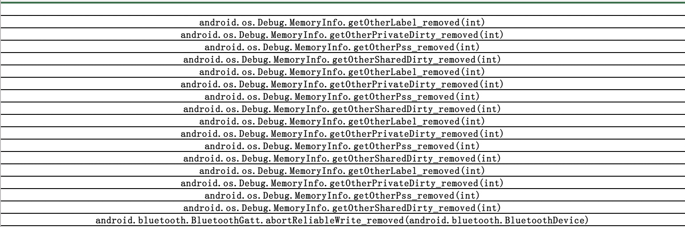

# Usage
```
python run.py [-v version] [-s status]
```

`-s (remove | add | deprecate)`
1. `remove` ：this label means you will find something are removal 
2. `add` ：something are addition
3. `deprecate` ： something are deprecated

`-v (19 | 19-20 | 19/22)`
you have many methods to use it, and to speedup data acquiring, I adopt multithreading。 

# Reuslt
